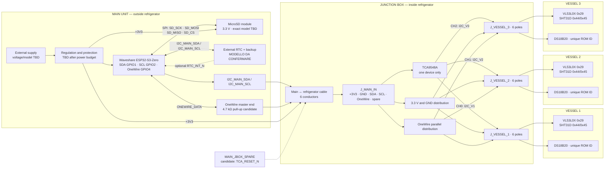

# FermentLab hardware architecture

Status: STEP 1 architecture, STEP 2 logical nets, and first editable native
KiCad 10 electrical draft. The draft deliberately stops before final GPIO,
module pinout, protection, and power-component selection.

## KiCad files

- `fermentlab.kicad_pro`: KiCad 10 project entry point.
- `fermentlab.kicad_sch`: native editable electrical architecture schematic.
- `fermentlab.kicad_sym`: project-local logical block symbols.
- `sym-lib-table`: project-local mapping for the `FermentLab` symbol library.
- `logical-netlist.csv`: controlled logical-net specification.
- `fermentlab.net`: netlist exported by `kicad-cli`.
- `fermentlab-erc.rpt`: latest command-line ERC report.
- `render/native/fermentlab.svg`: latest command-line schematic rendering.

Open `fermentlab.kicad_pro`, then `fermentlab.kicad_sch`. Keep the entire
directory together because the symbols are supplied by the project-local
library.

Validation was performed with `kicad-cli 10.0.6`. KiCad successfully upgraded
the schematic in place to the latest supported format, exported both SVG and
netlist, and completed ERC with **0 errors and 0 warnings**. This means the
current logical drawing is structurally valid; it does not yet approve the
unconfirmed physical module pinouts, GPIO allocation, regulator, cable
lengths, pull-up population, footprints, or connector part numbers.

## Design boundary

- One controller serves three vessels.
- Exactly one TCA9548A is installed in the refrigerated junction box.
- Each vessel has one VL53L0X, one SHT31D, and one externally powered
  DS18B20 waterproof probe.
- The Main Unit remains outside the refrigerator and contains the ESP32,
  MicroSD subsystem, external-power input, and any required regulation or
  protection.
- Controller confirmed: **Waveshare ESP32-S3-Zero**, based on the
  ESP32-S3FH4R2 with 4 MB Flash and 2 MB PSRAM.
- MicroSD: photographed 6-pin SPI module marked `3V3`, `CS`, `MOSI`, `CLK`,
  `MISO`, `GND`. Manufacturer/model and the circuitry on the other side remain
  **MODELLO DA CONFERMARE**.
- External RTC in the Main Unit: function approved. A `ZS-042`-style DS3231 +
  AT24C32 module appears to be available in the laboratory and is recorded as
  the prototype candidate; markings and reverse side of the actual board must
  still be verified before it becomes a confirmed part.
- Exact VL53L0X, SHT31D, and TCA9548A breakout boards: **MODELLI DA
  CONFERMARE**. Their regulators, level shifters, pull-ups, decoupling, and
  header pinouts must not be inferred from the IC datasheets.

## STEP 1 — system block diagram

## Electrical domains

### Power

`VIN_EXT` terminates in the Main Unit. The final input voltage, connector,
reverse-polarity protection, transient protection, and 3.3 V regulator are not
selected yet. `+3V3` and `GND` cross the refrigerator boundary once and fan out
in the junction box. A different net name will be introduced only if an actual
series element creates a distinct protected or filtered rail.

The photographed MicroSD module explicitly marks its supply pin `3V3`, so
`SD_VCC` is assigned to `+3V3`. The visible header order, from top to bottom in
the supplied photograph, is `3V3`, `CS`, `MOSI`, `CLK`, `MISO`, `GND`. Logic
must remain at 3.3 V. The reverse side is still required to identify local
decoupling, pull resistors, protection, or any other circuitry.

### I2C

The ESP32 is the only controller. The external RTC shares the local upstream
`I2C_MAIN_SDA` and `I2C_MAIN_SCL` nets in the Main Unit. Those nets then cross
the refrigerator boundary and terminate at the upstream side of the
TCA9548A. Only TCA channels 0, 1, and 2 are used.

Each selected channel contains one VL53L0X at 7-bit address `0x29` and one
SHT31D at `0x44` by default or `0x45` if its address pin is high. These addresses
do not conflict on the same channel. The TCA9548A itself is provisionally
`0x70` only if A2:A0 are all low.

Because the same sensor addresses recur on all three channels, firmware shall
normally enable only one TCA channel at a time. The existing 100 kHz firmware
setting is retained as the conservative initial target; final validation must
use measured cable lengths, total capacitance, actual breakout pull-ups, and
oscilloscope rise-time checks.

The upstream bus and every used downstream channel each require effective
pull-ups. Their values and locations remain TBD until the actual breakout
boards are identified. Parallel pull-ups already fitted to breakout boards
must be included in the effective-resistance calculation.

`TCA_RESET_N` currently has a provisional 10 kΩ pull-up to `+3V3` in the
logical schematic. It is not yet routed to the controller: the sixth
Main-to-Junction conductor remains `MAIN_JBOX_SPARE` until that choice is
approved.

### OneWire

`ONEWIRE_DATA` bypasses the TCA9548A. All three externally powered DS18B20
devices share `ONEWIRE_DATA`, `+3V3`, and `GND`; the firmware identifies them by
their unique 64-bit ROM IDs.

There is exactly one nominal 4.7 kΩ pull-up from `ONEWIRE_DATA` to `+3V3`.
The provisional location is the Main Unit, next to the OneWire master pin. It
must be validated on the complete harness. The junction-box fanout is a star,
and every waterproof probe already contributes about 2 m of cable; therefore
branch lengths and total cable length are required before this topology can be
approved without qualification.

### MicroSD SPI

`SD_SCK`, `SD_MOSI`, `SD_MISO`, and `SD_CS` remain entirely inside the Main
Unit. The photographed module uses 3.3 V supply and logic. GPIO assignment,
card-detect availability, pull resistors, and decoupling remain deferred until
the module reverse side and physical ESP32 are confirmed.

### External RTC and low-power operation

An external RTC is added to the Main Unit to preserve absolute date and time
through power-on resets and periods without Wi-Fi. It shares the upstream I2C
bus and does not pass through the TCA9548A. An optional open-drain alarm output
`RTC_INT_N` may wake the ESP32, but its GPIO remains unassigned until the
sleep/wake and SPI allocation review is complete.

Two candidates remain under review:

- `RV-3028-C7`: preferred candidate when battery autonomy dominates. It is a
  3.2 x 1.5 mm integrated RTC/crystal, uses 7-bit I2C address `0x52`, provides
  battery switchover, alarm and UNIX-time support, and is specified at about
  45 nA timekeeping current at 3 V and 25 °C. It is best suited to a custom PCB
  or a verified breakout.
- `DS3231`: preferred candidate when temperature-compensated accuracy and easy
  prototyping dominate. It uses 7-bit I2C address `0x68`, includes a TCXO and
  battery input, and is specified at ±2 ppm from 0 °C to 40 °C. Its VCC standby
  current is much higher than the RV-3028-C7, although backup-cell current is
  still low. Generic DS3231 modules must be reviewed for their battery circuit
  before choosing a rechargeable or non-rechargeable coin cell.

The pictured laboratory candidate is the common `ZS-042` layout. It exposes
`32K`, `SQW`, `SCL`, `SDA`, `VCC`, and `GND`, plus a duplicate four-pin I2C
header. This layout commonly includes a separate AT24C32 I2C EEPROM with
address-selection pads `A0`, `A1`, and `A2`, a power LED, I2C pull-ups, and a
diode/resistor path from VCC toward the coin cell. Board revisions and fitted
parts vary, so these details must be checked on the actual units rather than
copied blindly into KiCad.

For the prototype it shall be powered from 3.3 V and connected locally to
`I2C_MAIN_SDA` and `I2C_MAIN_SCL`. `SQW` can provide the optional active-low
alarm/wake signal `RTC_INT_N`; `32K` remains unconnected unless a later design
review establishes a need. The AT24C32 is not required by FermentLab because
MicroSD and ESP32 flash already provide storage, but its I2C address must still
be detected and documented if the chip is fitted.

Do not insert a non-rechargeable CR2032 into an unverified ZS-042 and then
power the module. Before using a CR2032, confirm with continuity/voltage tests
that no charging path reaches the cell, or deliberately disable that path on
the actual board. The change must be documented against the specific board
revision. A generic LIR2032 is not automatically approved either: the simple
diode/resistor network seen on many ZS-042 boards is not a controlled Li-ion
charger.

The ZS-042 is therefore suitable for functional firmware development but is
not the low-power reference for the final PCB. Its always-on LED and auxiliary
parts can dominate the RTC IC's own current while the Main Unit is powered.

Neither candidate conflicts with the provisional TCA9548A address `0x70` or
with the sensor addresses. The RTC alone does not produce the main energy
saving: firmware must also stop Wi-Fi between transfers and batch queued data
when battery operation is required. The ESP32-S3 internal RTC can keep time in
sleep but resets on power-on reset and its default RC clock can drift with
temperature, so it is not a full substitute for the external RTC.

## Confirmed controller and GPIO assignment

The final controller is the **Waveshare ESP32-S3-Zero**. The following three
assignments are now frozen because they match the hardware-tested firmware
profile and use ordinary broken-out GPIOs:

| Function | ESP32-S3-Zero pin | Status |
|---|---:|---|
| `I2C_MAIN_SDA` | GPIO1 | Confirmed |
| `I2C_MAIN_SCL` | GPIO2 | Confirmed |
| `ONEWIRE_DATA` | GPIO4 | Confirmed |

SPI MicroSD, `RTC_INT_N`, and any optional `TCA_RESET_N` GPIO are still
unassigned. GPIO0, GPIO3, GPIO45, and GPIO46 are strapping pins and will be
avoided unless their reset behavior is deliberately reviewed. GPIO19 and
GPIO20 are reserved for the board's native USB function, GPIO21 drives the
onboard WS2812 RGB LED, GPIO43/44 are the marked UART0 TX/RX pins, and
GPIO33–GPIO37 are not exposed because they are reserved for the board's Octal
PSRAM. The antenna end of the module requires a copper/component/metal
keep-out on any future carrier PCB.

## Address review

| Device | Bus segment | 7-bit address | Result |
|---|---|---:|---|
| TCA9548A | I2C main | 0x70 provisional | No conflict; requires A2:A0 low |
| External RTC | I2C main | 0x68 for ZS-042/DS3231; 0x52 for RV-3028-C7 | Candidate-dependent; no conflict |
| ZS-042 EEPROM | I2C main | 0x50–0x57, straps dependent | Present only if AT24C32 is fitted; verify actual straps |
| VL53L0X V1 | CH0 | 0x29 | Compatible with SHT31D on CH0 |
| SHT31D V1 | CH0 | 0x44 or 0x45 | Compatible with VL53L0X on CH0 |
| VL53L0X V2 | CH1 | 0x29 | Isolated from CH0 and CH2 |
| SHT31D V2 | CH1 | 0x44 or 0x45 | Isolated from CH0 and CH2 |
| VL53L0X V3 | CH2 | 0x29 | Isolated from CH0 and CH1 |
| SHT31D V3 | CH2 | 0x44 or 0x45 | Isolated from CH0 and CH1 |

Note: ST documents the VL53L0X address byte as `0x52`/`0x53`, which corresponds
to the conventional 7-bit address `0x29` used by the firmware and this design.

## Open decisions required before STEP 3

1. Photograph of the reverse/component side of the MicroSD module.
2. Photographs of both sides of one actual laboratory RTC board, including the
   DS3231 marking, EEPROM marking, coin-cell holder, diode, and resistor codes.
   Then decide whether ZS-042 remains prototype-only or is accepted for the
   assembled system; RV-3028-C7 remains the low-current final-PCB candidate.
3. Manufacturer/product links or clear photographs of all three breakout
   types: VL53L0X, SHT31D, and TCA9548A.
4. External supply type and rated output voltage/current; if battery operation
   is required, battery chemistry, nominal voltage, capacity, charger, and
   desired autonomy.
5. Length and construction of the Main Unit-to-junction cable.
6. Length of each 6 x 26 AWG vessel cable, in addition to the approximately
   2 m cable fitted to each DS18B20 probe.
7. Whether conductor 6 between Main Unit and junction must remain spare or may
   become `TCA_RESET_N` for recovery from a stuck downstream I2C bus.
8. Whether all vessel connectors must use an identical keyed pinout.

## Primary references

- Texas Instruments, TCA9548A datasheet:
  https://www.ti.com/lit/ds/symlink/tca9548a.pdf
- STMicroelectronics, VL53L0X datasheet:
  https://www.st.com/resource/en/datasheet/vl53l0x.pdf
- Sensirion, SHT3x-DIS datasheet:
  https://sensirion.com/media/documents/213E6A3B/63A5A569/Datasheet_SHT3x_DIS.pdf
- Analog Devices, DS18B20 datasheet:
  https://www.analog.com/media/en/technical-documentation/data-sheets/ds18b20.pdf
- Analog Devices, Guidelines for Reliable Long Line 1-Wire Networks:
  https://www.analog.com/en/resources/technical-articles/guidelines-for-reliable-long-line-1wire-networks.html
- Micro Crystal, RV-3028-C7 application manual:
  https://www.microcrystal.com/fileadmin/Media/Products/RTC/App.Manual/RV-3028-C7_App-Manual.pdf
- Analog Devices, DS3231 datasheet:
  https://www.analog.com/media/en/technical-documentation/data-sheets/DS3231.pdf
- ZS-042 charging-circuit reverse engineering used only as a board-verification
  aid (not a manufacturer specification):
  https://www.onetransistor.eu/2019/07/zs042-ds3231-battery-charging-circuit.html
- Espressif, ESP32-S3 system time:
  https://docs.espressif.com/projects/esp-idf/en/stable/esp32s3/api-reference/system/system_time.html
- Waveshare, ESP32-S3-Zero hardware documentation and pinout:
  https://docs.waveshare.com/ESP32-S3-Zero
- Waveshare, ESP32-S3-Zero board schematic:
  https://files.waveshare.com/wiki/ESP32-S3-Zero/ESP32-S3-Zero-Sch.pdf
- Espressif, ESP32-S3 GPIO restrictions and strapping pins:
  https://docs.espressif.com/projects/esp-idf/en/stable/esp32s3/api-reference/peripherals/gpio.html
